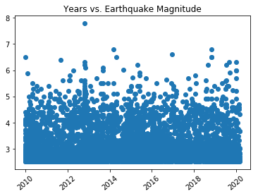
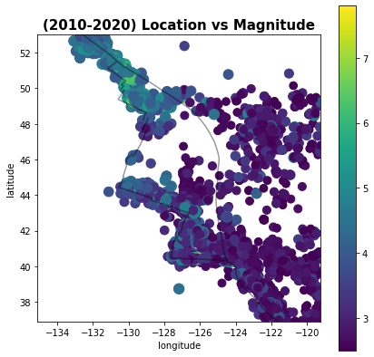
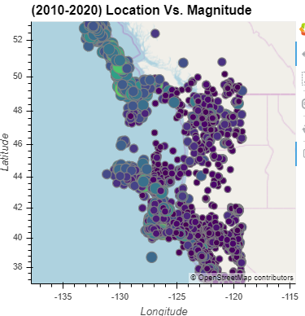
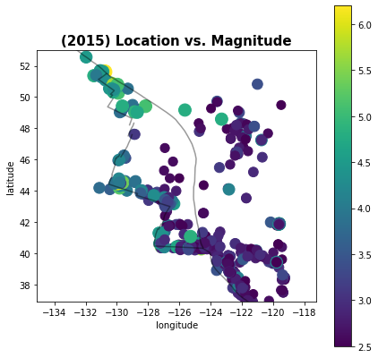
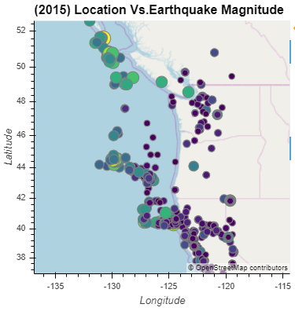
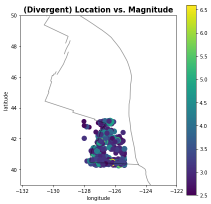
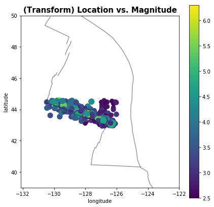

# Plate Tectonics

## Part I: Plate Boundary Features

                figure 1 Time Vs. Earthquake Magnitude 

                figure 2 Location Vs. Earthquake Magnitude between 2010 and 2020
        
        

                figure 3 Location Vs. Earthquake Magnitude in 2015

## Part II: Divergent Boundary vs Transform Boundary

                figure 4 Location Vs. Earthquake Magnitude at Divergent Boundary
        
        
        

                figure 5 Location Vs. Earthquake Magnitude at Transform Boundary

