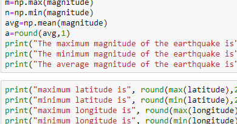

# Plate Tectonics

## Part I: Plate Boundary Features

                figure 1
        
        

                figure 2

## Part II: Divergent Boundary vs Transform Boundary

        figure 3
        
        
        

        figure 4

