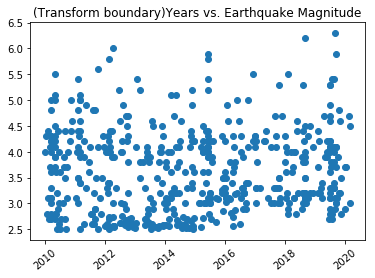

# Plate Tectonics

### Part I: Plate Boundary Features

                Figure 1: Time Vs. Earthquake Magnitude 

                Figure 2: Location Vs. Earthquake Magnitude between 2010 and 2020
                

                Figure 3: Location Vs. Earthquake Magnitude in 2015

### Part II: Divergent Boundary vs Transform Boundary

                Figure 4: Location Vs. Earthquake Magnitude at Divergent Boundary       

                Figure 5: Location Vs. Earthquake Magnitude at Transform Boundary

This project requires getting earthquake data that includes Juan De Fuca Plate between 2010 and 2020 from USGS earthquake catalog [1] and plot the magnitude of the earthquakes in a span of 10 years using circles. Then, plot the earthquakes on the map according to the corresponding locations, analyze what happened in 2015, and show the earthquake magnitude on divergent boundary and transform boundary [2].

According to figure 2, most of the earthquakes occurred at divergence, transform, and subduction zones. In divergence zone, Juna De Fuca Plate and Pacific Plate move away from each other; in transform boundary, the two plates slide against each other; and in subduction zone, one plate is moves underneath the other plate [3]. All those plate movements caused earthquakes. Between 2010 and 2020, the data showed that the maximum magnitude of the earthquake was 7.8, the minimum was 2.5, and the average was 3.1. In April 2015, eruption occurred in Axial caldera, Juan de Fuca ridge and had a lava flow volume of 1.48 × 10^8 m^3 [4]. Most of the earthquakes were located at the transform and divergence zones, as shown in figure 3.

When looking at the divergent boundary, figure 4, the average magnitude of earthquake increased from 2010 to 2018 and started to decrease. The minimum earthquake magnitude didn't change noticeable, but the maximum magnitude slowly increased. On the other hand, at the transform boundary, the minimum earthquake magnitude increased as time passed, and average and maximum earthquake magnitude fluctuated but steadily increased as depicted in figure 5.

This project illustrates that the movement between two plates caused earthquakes with different ranges in magnitude. In 2015, an eruption occurred at Juan de Fuca ridge, and the data indicated that average magnitude of earthquakes fluctuated but slowly increased within the last decade.

## References

[1]https://earthquake.usgs.gov/earthquakes/map/

[2]https://medium.com/@ianforrest11/graphing-latitudes-and-longitudes-on-a-map-bf64d5fca391

[3]http://academic.brooklyn.cuny.edu/geology/grocha/plates/platetec16.htm

[4]https://agupubs.onlinelibrary.wiley.com/doi/full/10.1002/2016GC006734?fbclid=IwAR01s0hTHJ8LXocLGK99gK0ic5MZ_Dl6sMTbZTUiDRZJrUCRmrkLhaZzaJ4

